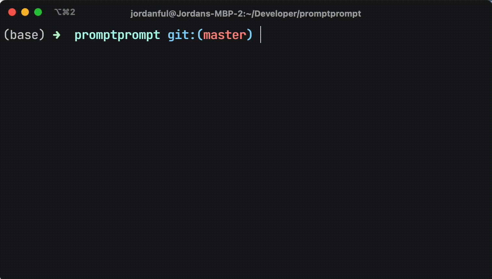

```
                    $$\   $$\
                    \__|  $$ |
 $$$$$$\   $$$$$$\  $$\ $$$$$$\
$$  __$$\  \____$$\ $$ |\_$$  _|
$$ /  $$ | $$$$$$$ |$$ |  $$ |
$$ |  $$ |$$  __$$ |$$ |  $$ |$$\
\$$$$$$$ |\$$$$$$$ |$$ |  \$$$$  |
 \____$$ | \_______|\__|   \____/
$$\   $$ |
\$$$$$$  |
 \______/
```

Gait is an AI-powered CLI that helps you interact with git repositories using plain old English.

So, instead of memorizing git commands, you can just ask Gait to do it for you.
Or if you get stuck in a sticky situation, just describe what you'd like to do and Gait will help you out.



## Installation

Get yourself an OpenAI API key (local LLM support coming soon).
`npm install -g gait`

## Usage

`gait setup` will get you set up.
Then just `gait <query>`, e.g. `gait add all files` or `gait reset last commit`.

Gait will confirm your query before executing it.